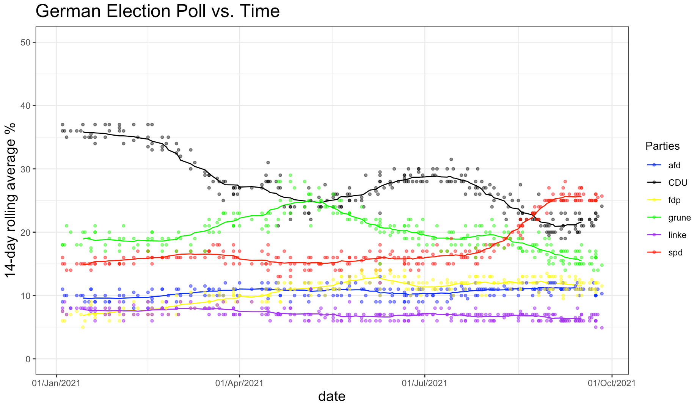

<!--more-->

##  Case Background

The Guardian newspaper has an [election poll tracker for the upcoming German election](https://www.theguardian.com/world/2021/aug/20/german-election-poll-tracker-who-will-be-the-next-chancellor).
The list of the opinion polls since Jan 2021 can be found at [Wikipedia](https://en.wikipedia.org/wiki/Opinion_polling_for_the_2021_German_federal_election) 


##  Data Processing
The following code will scrape the wikipedia page and import the table in a dataframe.

```{r, scrape_wikipedia_polling_data, warnings= FALSE, message=FALSE}
url <- "https://en.wikipedia.org/wiki/Opinion_polling_for_the_2021_German_federal_election"

# similar graphs and analyses can be found at 
# https://www.theguardian.com/world/2021/jun/21/german-election-poll-tracker-who-will-be-the-next-chancellor
# https://www.economist.com/graphic-detail/who-will-succeed-angela-merkel
# get tables that exist on wikipedia page 
tables <- url %>% 
  read_html() %>% 
  html_nodes(css="table")
# parse HTML tables into a dataframe called polls 
# Use purr::map() to create a list of all tables in URL
polls <- map(tables, . %>% 
             html_table(fill=TRUE)%>% 
             janitor::clean_names())
# list of opinion polls
german_election_polls <- polls[[1]] %>% # the first table on the page contains the list of all opinions polls
  slice(2:(n()-1)) %>%  # drop the first row, as it contains again the variable names and last row that contains 2017 results
  mutate(
         # polls are shown to run from-to, e.g. 9-13 Aug 2021. We keep the last date, 13 Aug here, as the poll date
         # and we extract it by picking the last 11 characters from that field
         end_date = str_sub(fieldwork_date, -11),
         
         # end_date is still a string, so we convert it into a date object using lubridate::dmy()
         end_date = dmy(end_date),
         
         # we also get the month and week number from the date, if we want to do analysis by month- week, etc.
         month = month(end_date),
         week = isoweek(end_date)
         )

german_election_polls0<-german_election_polls
german_election_polls<- german_election_polls %>% 
  arrange(end_date) %>% 
  group_by(end_date) %>% 
  summarise(CDU_m=mean(union),spd_m=mean(spd),afd_m=mean(af_d),fdp_m=mean(fdp),linke_m=mean(linke),grune_m=mean(grune))

election_rolling_mean <- german_election_polls %>%   # this is a new object
  mutate( 
    #calculate 3-day rolling average
    CDU=zoo::rollmean(CDU_m, k=14, fill = NA),
    afd=zoo::rollmean(afd_m, k=14, fill = NA),
    spd = zoo::rollmean(spd_m, k=14, fill = NA),
    fdp = zoo::rollmean(fdp_m, k=14, fill = NA),
    linke= zoo::rollmean(linke_m, k=14, fill = NA),
    grune = zoo::rollmean(grune_m, k=14, fill = NA)
    ) 

election_rolling_mean<-na.omit(election_rolling_mean)
election_rolling<-data.frame(x=unlist(election_rolling_mean[,8:13]))
election_rolling[,2]<-rep(c("CDU","afd","spd","fdp","linke","grune"),each=nrow(election_rolling_mean))
election_rolling[,3]<-rep(election_rolling_mean$end_date,6)
names(election_rolling)[2]<-"Parties"

p<-data.frame(x=unlist(german_election_polls0[,5:10]))
p[,2]<-rep(c("CDU","spd","afd","fdp","linke","grune"),each=nrow(german_election_polls0))
p[,3]<-rep(c(german_election_polls0$end_date),6)

ggplot() +
  geom_line(data=election_rolling, aes(x=V3,y=x,colour=Parties)) +
  ylim(0, 50)+
  geom_point(data=p,aes(y=x,x=V3,colour=V2),alpha=0.5,size=1)+
  scale_x_date(date_labels = "%d/%b/%Y")+
  theme_bw()+
    theme(legend.position = "none")+
    labs(
    title = "German Election Poll vs. Time",
    x = "date",
    y = "14-day rolling average %",
    )+
  theme(plot.title = element_text(size=18),plot.subtitle = element_text(size=16),axis.title.x =element_text(size = 14),axis.title.y = element_text(size = 14))+
  scale_color_manual(values = c("blue","black" , "yellow","green","purple","red"))+
  theme(legend.position="right")+
    NULL
```




