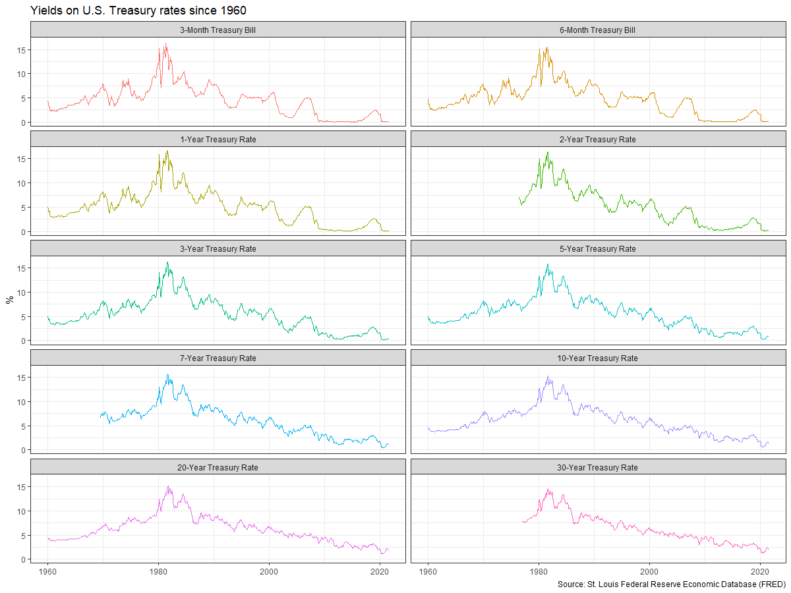
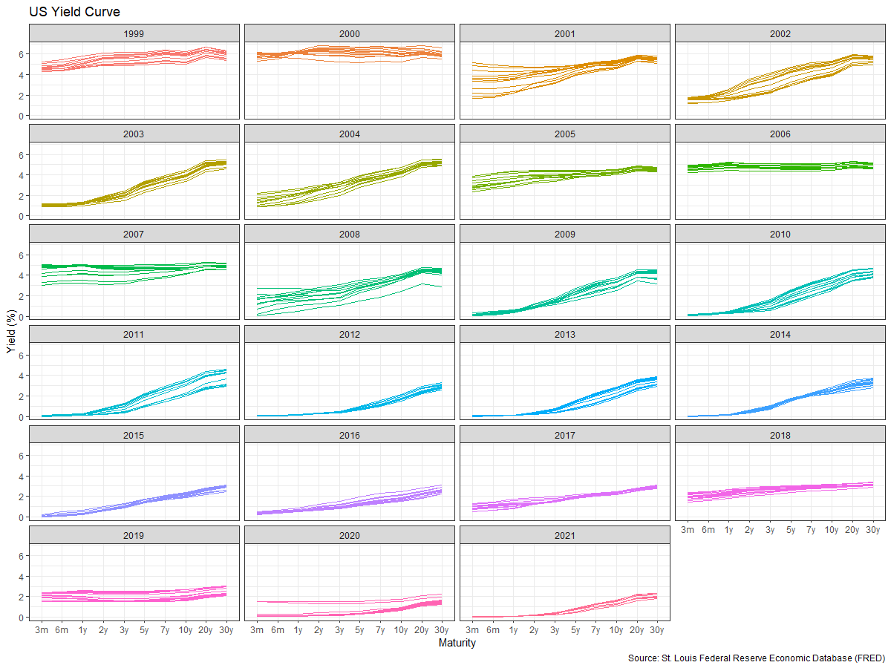
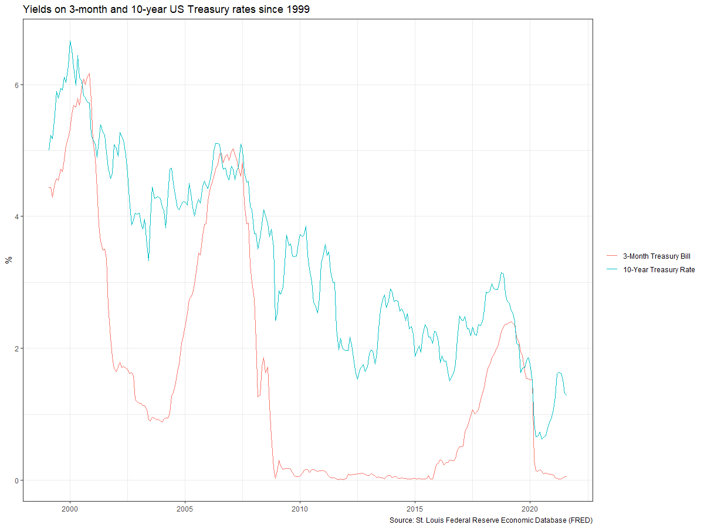
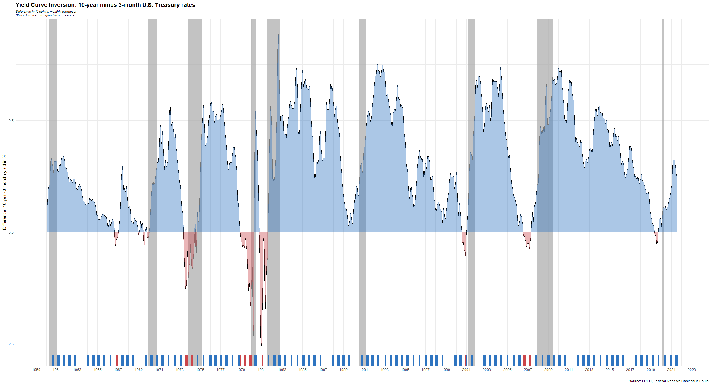

---
aliases:
- migrate-from-jekyl
author: Hanrui Wang
categories:
- RMarkdown
- Economy
tags:
- RMarkdown
- Economy
date: "2021-10-06"
description: Excess rentals in TfL bike sharing
image: kk.jpg
series:
- Themes Guide
title: Yield Curve Inversion
---

Every so often, we hear warnings from commentators on the "inverted yield curve" and its predictive power with respect to recessions. An explainer what a [inverted yield curve is can be found here](https://www.reuters.com/article/us-usa-economy-yieldcurve-explainer/explainer-what-is-an-inverted-yield-curve-idUSKBN1O50GA). If you'd rather listen to something, here is a great podcast from [NPR on yield curve indicators](https://www.podbean.com/media/share/dir-4zgj9-6aefd11)

In addition, many articles and commentators think that, e.g., [*Yield curve inversion is viewed as a harbinger of recession*](https://www.bloomberg.com/news/articles/2019-08-14/u-k-yield-curve-inverts-for-first-time-since-financial-crisis). One can always doubt whether inversions are truly a harbinger of recessions, and [use the attached parable on yield curve inversions](https://twitter.com/5_min_macro/status/1161627360946511873).

We will look at US data and use the [FRED database](https://fred.stlouisfed.org/) to download historical yield curve rates, and plot the yield curves since 1999 to see when the yield curves flatten. If you want to know more, a very nice article that explains the [yield curve is and its inversion can be found here](https://fredblog.stlouisfed.org/2018/10/the-data-behind-the-fear-of-yield-curve-inversions/). 


## Load the yield curve data file 

Load the yield curve data file that contains data on the yield curve since 1960-01-01.
Our dataframe `yield_curve` has five columns (variables):

```{r}
glimpse(yield_curve)
```

Rows: 6,884  
Columns: 5  
$ date      <date> 1960-01-01, 1960-02-01, 1960-03-01, 1960-04-01, 1960-05-01, 1960-0…  
$ series_id <chr> "TB3MS", "TB3MS", "TB3MS", "TB3MS", "TB3MS", "TB3MS", "TB3MS", "TB3…  
$ value     <dbl> 4.35, 3.96, 3.31, 3.23, 3.29, 2.46, 2.30, 2.30, 2.48, 2.30, 2.37, 2…  
$ maturity  <chr> "3m", "3m", "3m", "3m", "3m", "3m", "3m", "3m", "3m", "3m", "3m", "…  
$ duration  <chr> "3-Month Treasury Bill", "3-Month Treasury Bill", "3-Month Treasury…  

- `date`: already a date object
- `series_id`: the FRED database ticker symbol
- `value`: the actual yield on that date
- `maturity`: a short hand for the maturity of the bond
- `duration`: the duration, written out in all its glory!


## Plotting the yield curve


### Yields on US rates by duration since 1960


```{r yield_curves_maturities, echo=FALSE, out.width="100%"}
duration_order <- c("3-Month Treasury Bill", "6-Month Treasury Bill", "1-Year Treasury Rate", "2-Year Treasury Rate", "3-Year Treasury Rate", "5-Year Treasury Rate","7-Year Treasury Rate","10-Year Treasury Rate","20-Year Treasury Rate","30-Year Treasury Rate")
adapted_yc <- yield_curve %>%  # Plotting the yields for different maturities over time
  mutate(duration = factor(duration, levels=duration_order)) # Sort the duration by increasing order of maturities
ggplot(adapted_yc, aes(x=date, y=value, colour=duration)) + geom_line() + facet_wrap(~duration, ncol=2) + theme_bw() + theme(legend.position = "none") +
  labs (
    title = "Yields on US Treasury rates since 1960",
    y = "%",
    x = "", 
      caption="Source: St Louis Federal Reserve Economic Database (FRED)"
  )
```



### Monthly yields on US rates by duration since 1999 on a year-by-year basis

```{r yield_curve_2, echo=FALSE, out.width="100%"}
yield_curve_1999_onward <- yield_curve %>% 
  filter(year(date) %in% c(1999:2021)) %>% # filter for years between 1999 and 2021
  mutate(year=factor(year(date)), maturity=factor(maturity, levels=c("3m", "6m", "1y", "2y", "3y", "5y", "7y", "10y", "20y", "30y"))) #  Sort the duration by increasing order of maturities

# plot the US yield curves for each year 
ggplot(yield_curve_1999_onward,aes(x = maturity, y = value,group=date, colour=year, alpha=0.5)) + 
geom_line(show.legend = FALSE,size=0.8) +
facet_wrap(~ year, ncol = 4, nrow = 6)+
coord_cartesian(ylim = c(0, 7))+
theme(legend.position = "none") + theme_bw() +
  theme(text = element_text(size=8)) +
labs (
  title = "US Yield Curve",
  y = "Yield (%)",
  x = "Maturity", 
  caption="Source: St Louis Federal Reserve Economic Database (FRED)"

)
```


### 3-month and 10-year yields since 1999

```{r yield_curves_recessions, echo=FALSE, out.width="100%"}
recessions_yc <- yield_curve %>%  # Filter for 3m and 10y maturities and select years from 1999
  filter(maturity %in% c("3m","10y")) %>% 
  filter(year(date) %in% c(1999:2021))
# plot the yields on 3-month and 10-year US Treasury rates since 1999
ggplot(recessions_yc, aes(x=date, y=value, colour=duration)) + geom_line() + theme_bw() + theme(legend.title = element_blank()) +
  labs(
    title = "Yields on 3-month and 10-year US Treasury rates since 1999",
    y="%",
    x="", 
    caption="Source: St Louis Federal Reserve Economic Database (FRED)")
```




According to [Wikipedia's list of recession in the United States](https://en.wikipedia.org/wiki/List_of_recessions_in_the_United_States), since 1999 there have been two recession in the US: between Mar 2001–Nov 2001 and between Dec 2007–June 2009. Does the yield curve seem to flatten before these recessions? Can a yield curve flattening really mean a recession is coming in the US? Since 1999, when did short-term (3 months) yield more than longer term (10 years) debt?

The yield curve flattens right before the two recessions in 2001 and 2007. While there is evidence that after the yield curve inverts a recession happens, there is not always a direct relationship between these two aspects. For example, the yield curve inverted in the end of 2019 and a recession was subsequently caused by an unpredictable event, namely the COVID pandemic.

Besides calculating the spread (10year - 3months), there are a few things we need to do to produce our final plot

1. Setup data for US recessions 
1. Superimpose recessions as the grey areas in our plot
1. Plot the spread between 30 years and 3 months as a blue/red ribbon, based on whether the spread is positive (blue) or negative(red)

- For the first, the code below creates a dataframe with all US recessions since 1946

```{r setup_US-recessions, echo=FALSE, out.width="100%"}
# get US recession dates after 1946 from Wikipedia 
# https://en.wikipedia.org/wiki/List_of_recessions_in_the_United_States
recessions <- tibble(
  from = c("1948-11-01", "1953-07-01", "1957-08-01", "1960-04-01", "1969-12-01", "1973-11-01", "1980-01-01","1981-07-01", "1990-07-01", "2001-03-01", "2007-12-01","2020-02-01"),  
  to = c("1949-10-01", "1954-05-01", "1958-04-01", "1961-02-01", "1970-11-01", "1975-03-01", "1980-07-01", "1982-11-01", "1991-03-01", "2001-11-01", "2009-06-01", "2020-04-30") 
  )  %>% 
  mutate(From = ymd(from), 
         To=ymd(to),
         duration_days = To-From) %>% 
  filter(From >=ymd("1960-01-01"))
recessions
```

```{r plot}

recessions_yc <- yield_curve %>% # filter whole data for 3m and 10y maturity 
  filter(maturity %in% c("3m","10y"))  
  
recessions_yc_3m <- recessions_yc %>% # create a data for 3m maturities
  filter(maturity=="3m") %>% 
  mutate(value_3m=value)

recessions_yc_10y <- recessions_yc %>% # create a data for 10y maturities
  filter(maturity=="10y") %>% 
    mutate(value_10y=value)

chart<-left_join(recessions_yc_10y,recessions_yc_3m,by="date") %>% # create a data to connect the two 3m and 10y datasets and create a difference column
  mutate(negative=value_10y-value_3m)


ggplot( ) + 
    # Add the colours between 0 and the difference in maturities
    geom_ribbon(data=chart, aes(x=date, y=negative, ymin = 0, ymax = pmax(negative, 0), fill = "positive")) + geom_rug()+
    geom_ribbon(data=chart, aes(x=date, y=negative, ymin = pmin(negative, 0), ymax =0 , fill = "negative")) +
    scale_fill_manual(values=c("#eab5b7", "#abc7e6")) +
    # Add the recessions times
    geom_rect(data=recessions, mapping=aes(xmin = From, xmax = To, ymin = -Inf, ymax = Inf, alpha = .5),fill = "grey60") + 
    # Final adjustments: theme and rug
    theme(legend.position = "none")+
    geom_rug(data=chart, aes(x=date, y=negative, ymin = 0, ymax = pmax(negative, 0), alpha=0.5), sides = "b",colour="grey60") +

    labs(
    title = "Yield curve inversion: 10-year minus 3-month U.S. Tresury rates",
    subtitle = "Difference in % points, monthly averages.",
    x="",
    y="Difference (10 year-3 month) yield in %", 
    caption="Source: Federal Reserve Economic Database of St Louis (FRED)")+
  NULL

```




