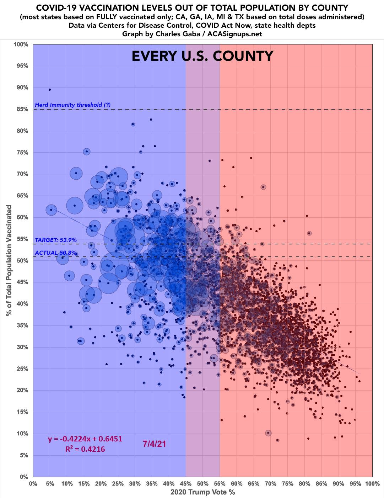
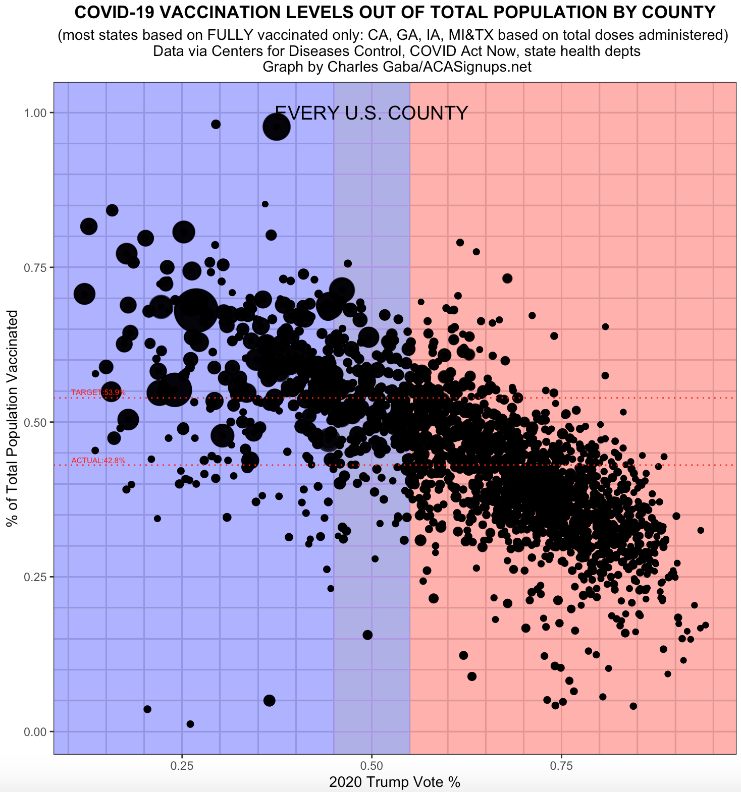

<!--more-->


##  Case Background
 
Read the  article [The Racial Factor: There's 77 Counties Which Are Deep Blue But Also Low-Vaxx. Guess What They Have In Common?](https://acasignups.net/21/07/18/racial-factor-theres-77-counties-which-are-deep-blue-also-low-vaxx-guess-what-they-have) and have a look at the attached figure.


##  Data Cleaning
1. To get vaccination by county, we will use [data from the CDC](https://data.cdc.gov/Vaccinations/COVID-19-Vaccinations-in-the-United-States-County/8xkx-amqh) 
1. You need to get [County Presidential Election Returns 2000-2020](https://dataverse.harvard.edu/dataset.xhtml?persistentId=doi:10.7910/DVN/VOQCHQ)
1. Finally, you also need an estimate of the [population of each county](https://www.ers.usda.gov/webdocs/DataFiles/48747/PopulationEstimates.csv?v=2232)

```{r, echo=FALSE, cache=TRUE}
# Download CDC vaccination by county
cdc_url <- "https://data.cdc.gov/api/views/8xkx-amqh/rows.csv?accessType=DOWNLOAD"
vaccinations <- vroom(cdc_url) %>% 
  janitor::clean_names() %>% 
  filter(fips != "UNK") # remove counties that have an unknown (UNK) FIPS code
# Download County Presidential Election Returns
# https://dataverse.harvard.edu/dataset.xhtml?persistentId=doi:10.7910/DVN/VOQCHQ
election2020_results <- vroom(here::here("data", "countypres_2000-2020.csv")) %>% 
  janitor::clean_names() %>% 
  # just keep the results for the 2020 election
  filter(year == "2020") %>% 
    # change original name county_fips to fips, to be consistent with the other two files
  rename (fips = county_fips)
# Download county population data
population_url <- "https://www.ers.usda.gov/webdocs/DataFiles/48747/PopulationEstimates.csv?v=2232"
population <- vroom(population_url) %>% 
  janitor::clean_names() %>% 
  
  # select the latest data, namely 2019
  select(fips = fip_stxt, pop_estimate_2019) %>% 
  
  # pad FIPS codes with leading zeros, so they are always made up of 5 characters
  mutate(fips = stringi::stri_pad_left(fips, width=5, pad = "0"))
```


##  Plotting
```{r challenge 1}
# Assuming that all citizen below 18 are not vaccinated and do not participate in the elections.
TrumpVt<-election2020_results %>% 
  filter(mode=="TOTAL") %>% 
  select(fips, candidate, candidatevotes,totalvotes) %>% 
  filter(candidate=="DONALD J TRUMP") %>% 
  mutate(TrumpVt=candidatevotes/totalvotes) %>% 
  group_by(fips) %>% 
  summarise(vote_pct=max(TrumpVt))

PopVac<-vaccinations %>% 
 mutate(pct=case_when(recip_state %in% c('CA','GA','IA','MI','TX')~administered_dose1_pop_pct,TRUE~series_complete_pop_pct)) %>% 
  filter(pct>0,date=="09/23/2021") %>% 
  select(fips, pct) %>% 
  mutate(pct=pct/100)

Chart<-population %>% 
  left_join(TrumpVt, by="fips") %>% 
  left_join(PopVac, by="fips")
Chart<-na.omit(Chart)
Chart[Chart$vote_pct>1,3]<-1 
Chart[Chart$pct>1,4]<-1

ggplot(Chart,aes(x=vote_pct,y=pct)) + 
    theme_bw()+
    theme(legend.position = "none")+
    theme(legend.title = element_blank()) +  
    geom_rect(aes(xmin = 0.45, xmax = Inf, ymin = -Inf, ymax = Inf),fill = "#ffa7a6", alpha = 0.03)+
    geom_rect(aes(xmin = -Inf, xmax = 0.55, ymin = -Inf, ymax = Inf),fill = "#a6a6fe", alpha = 0.03)+
    geom_point(aes(size=pop_estimate_2019,alpha=.005)) + 
    geom_point()+
    scale_size_continuous(range = c(1.5, 15))+
    theme(plot.title = element_text(size=13,hjust = 0.5,face = "bold"),plot.subtitle = element_text(size=11,hjust = 0.5),axis.title.x = element_text(size = 11),axis.title.y = element_text(size = 11))+
    labs(
    title = "COVID-19 VACCINATION LEVELS OUT OF TOTAL POPULATION BY COUNTY",
    subtitle = "(most states based on FULLY vaccinated only: CA, GA, IA, MI&TX based on total doses administered) \n Data via Centers for Diseases Control, COVID Act Now, state health depts\n Graph by Charles Gaba/ACASignups.net",
    x = "2020 Trump Vote %",
    y = "% of Total Population Vaccinated",
    )+
  geom_hline(yintercept = 0.539,linetype='dotted',col="red")+
  annotate("text", x = 0.14, y = 0.54, label = "TARGET:53.9%", vjust = -0.5,size=2,col="red")+
  geom_hline(yintercept = mean(Chart$pct),linetype='dotted',col="red")+
  annotate("text", x = 0.14, y = 0.43, label = "ACTUAL:42.8%", vjust = -0.5,size=2,col="red")+
   theme(panel.grid.minor  = element_line(colour="black", size = 0.5),
     panel.grid.major = element_line(colour="black", size = 0.5))+
    scale_x_continuous(minor_breaks = seq(0, 1, 0.05))+
    scale_y_continuous(minor_breaks = seq(0 ,1, 0.05))+
   annotate("text", x = 0.5, y = 1, label = "EVERY U.S. COUNTY",size=5,face="bold")+
    NULL
```



You may find counties that as of September 2021 have 0% vaccination:

In Texas and Georgia, for example, where the vast majority of villages have no vaccination records, [rural residents in those states are still hesitant to get vaccinated](https://www.gpb.org/news/2021/06/03/low-vaccination-rates-put-georgia-at-risk-of-covid-19-spikes-cdc-director-says), according to local leaders.


