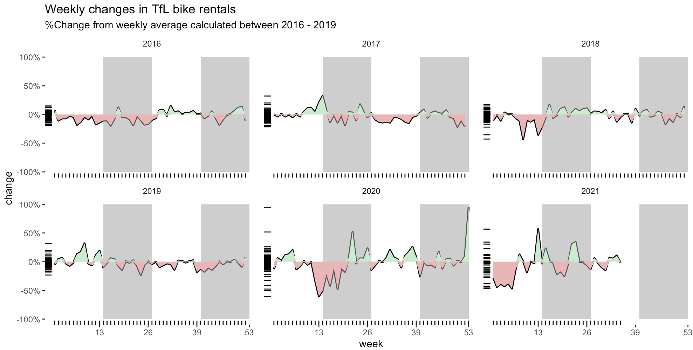

---
aliases:
- migrate-from-jekyl
author: Hanrui Wang
categories:
- RMarkdown
tags:
- RMarkdown
date: "2021-10-06"
description: Excess rentals in TfL bike sharing
image: ttt.jpg
series:
- Themes Guide
title: TfL Data Analysis
---

Latest TfL data on how many bikes were hired every single day can be got from [London DataStore](https://data.london.gov.uk).

<!--more-->

## Data Cleaning

```{r, get_tfl_data, cache=TRUE}
url <- "https://data.london.gov.uk/download/number-bicycle-hires/ac29363e-e0cb-47cc-a97a-e216d900a6b0/tfl-daily-cycle-hires.xlsx"

# Download TFL data to temporary file
httr::GET(url, write_disk(bike.temp <- tempfile(fileext = ".xlsx")))

# Use read_excel to read it as dataframe
bike0 <- read_excel(bike.temp,
                   sheet = "Data",
                   range = cell_cols("A:B"))

# change dates to get year, month, and week
bike <- bike0 %>% 
  clean_names() %>% 
  rename (bikes_hired = number_of_bicycle_hires) %>% 
  mutate (year = year(day),
          month = lubridate::month(day, label = TRUE),
          week = isoweek(day))
```

Create a facet grid that plots bikes hired by month and year.

 


## Excess Rentals in TfL Bike Sharing
### Absolute_Monthly_Change

```{r tfl_absolute_monthly_change_our_coding}
bikerentals<-bike %>% 
  group_by(year,month) %>% 
  summarise(monthlyave=mean(bikes_hired))
bikeave<- bike %>% 
  group_by(month) %>% 
  summarise(totalave=mean(bikes_hired))
bikerentals <-bikerentals %>% 
  filter(year %in% c(2016,2017,2018,2019,2020,2021))
bikerentals$monthlyave<-bikerentals$monthlyave-3015.56
chart<-left_join(bikerentals,bikeave,by="month") 
ggplot(chart, aes(month, monthlyave,group=1)) + facet_wrap(~year) + 
    geom_line(size = 1) + 
    geom_line(aes(month, totalave),colour='#1827e7', size = 1) + 
    theme(legend.position = 'none', strip.background = element_blank(), panel.background = element_blank())+
  
    geom_ribbon(aes(ymin = monthlyave, ymax = pmin(monthlyave, totalave), fill = "positive")) + 
    geom_ribbon(aes(ymin = totalave, ymax = pmin(monthlyave, totalave), fill = "negative")) +
    scale_fill_manual(values=c("#eab5b7", "#cbebce")) +
    theme(axis.text.x = element_text(angle = 90, hjust = 1)) +
 
  
   labs (
    title = "Monthly changes in TfL bike rentals",
    subtitle = "Change from monthly average shown in blue and calculated between 2016 - present",
    x     = "month",
    y = "Bike rentals"
  )+
  NULL
```

 


### Absolute_Weekly_Change

Look at the percentage changes from the expected level of weekly rentals. The two grey shaded rectangles correspond to Q2 (weeks 14-26) and Q4 (weeks 40-52).

```{r tfl_absolute_weekly_change}
weekly_data <- bike %>% # Summing up the bike rentals for each week and filtering for 2016 - 2021
  filter(year %in% c(2016,2017,2018,2019,2020,2021), week %in% c(1:52)) %>% 
  group_by(year,week) %>% 
  summarise(ave_bike=mean(bikes_hired))

week53<-bike[bike$week=="53" & bike$year %in% c("2020","2021"),] %>% 
  mutate(year=2020) %>% 
  group_by(year,week) %>% 
  summarise(ave_bike=mean(bikes_hired))
weekly_data[nrow(weekly_data) + 1,] = week53

weekave<- bike %>% 
  filter(year %in% c(2016,2017,2018,2019)) %>% 
  group_by(week) %>% 
  summarise(ave=mean(bikes_hired))

graph<-left_join(weekly_data,weekave,by="week") %>%  
  mutate(change=((ave_bike-ave)/ave)-0.025)
ggplot(graph,aes(x=week,y=change)) + facet_wrap(vars(year)) + geom_line(size = 1) + 
  annotate("rect", xmin = 14, xmax = 27, ymin = -1, ymax = 1, alpha = .5,fill = "grey60") + 
  annotate("rect", xmin = 40, xmax = 53, ymin = -1, ymax = 1, alpha = .5,fill = "grey60") +
    theme(legend.position = 'none', 
          panel.background = element_blank(), 
          strip.background = element_blank(),
          panel.grid.major = element_line(colour = "grey70", size = 0))+
    geom_ribbon(aes(ymin = 0, ymax = pmax(change, 0), fill = "positive")) + 
    geom_ribbon(aes(ymin = pmin(change, 0), ymax =0 , fill = "negative")) +
    scale_fill_manual(values=c("#eab5b7", "#cbebce")) +
  geom_rug(sides = "bl") +
    scale_y_continuous(labels = scales::percent) +
    scale_x_continuous(breaks=c(13,26,39,53))+
 
   labs (
    title = "Weekly changes in TfL bike rentals",
    subtitle = "%Change from weekly average calculated between 2016 - 2019",
    x     = "week")+
  NULL
  
```
 

We used the mean to calculate the expected rentals, as most of the observations follow a normal distribution and are not significantly skewed. But it is true that there are some weeks and months for which the observations are not normally distributed. Because of that, We also had a look at the graphs using the median. It did not change much about the shape of the curves.


