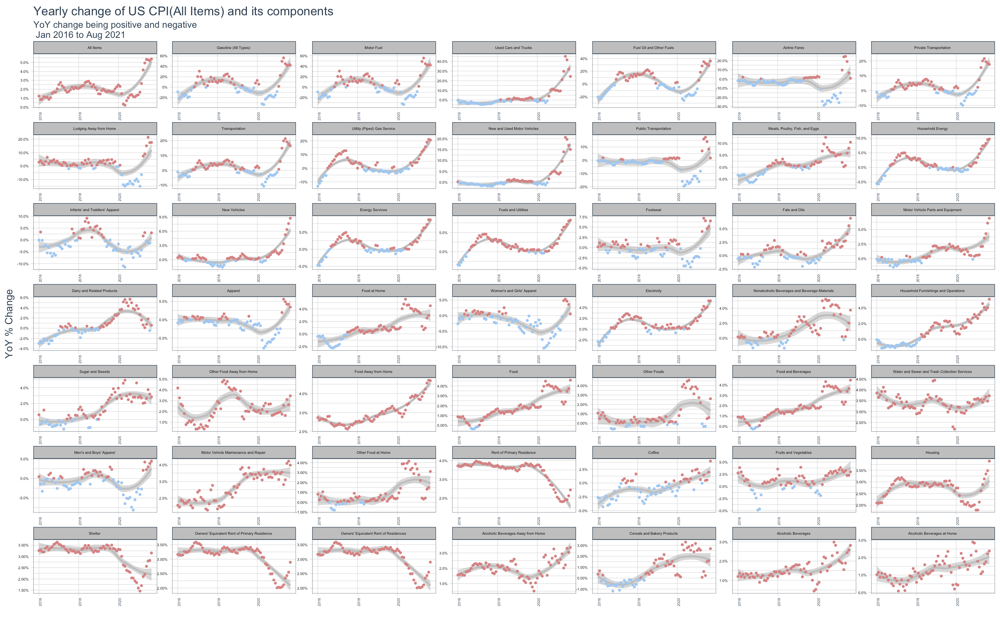
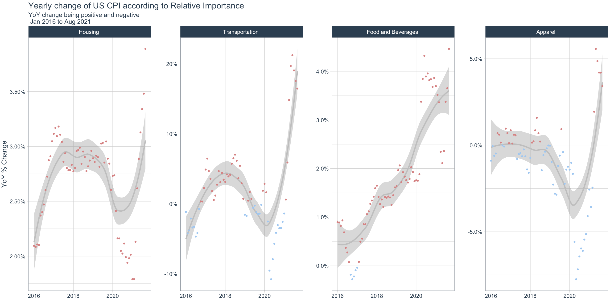

## Data Processing


### Find [CPI components at FRED](https://fredaccount.stlouisfed.org/public/datalist/843).

```{r,load_movies, warning=FALSE, message=FALSE}
movies <- read_csv(here::here("data", "movies.csv"))
```

### Data Cleaning

1. Generate a vector of components, and then pass it to `tidyquant::tq_get(get = "economic.data", from =  "2000-01-01")` to get all data since January 1, 2000

1. Since the data downloaded is an index with various starting dates, we have to calculate the yearly, or 12-month change, using the `lag` function, and specifically, `year_change = value/lag(value, 12) - 1`, which means comparing the current month's value with that 12 months ago lag(value, 12).
1. Order components so the higher the yearly change, the earlier does that component appear.
1. Make sure that the **All Items** CPI (CPIAUCSL) appears first.

```{r}
url <- "https://fredaccount.stlouisfed.org/public/datalist/843"
tables <- url %>% 
  read_html() %>% 
  html_nodes(css="table")
economic.data <- map(tables, . %>% 
             html_table(fill=TRUE)%>% 
             janitor::clean_names())
#economic.data, component is "list"
  # list of CPI component
component <- economic.data[[2]]
CPI.components <- component[2]
CPI.vector <- as.vector(unlist(CPI.components, use.names=FALSE))
k<-component[,1:2]
names(k)[2]<-"symbol"

# Pass symbols to tq_get to get economic data
FRED_data_m <- CPI.vector %>%
  tidyquant::tq_get(get = "economic.data", from =  "2000-01-01")

FRED_data<-left_join(k,FRED_data_m,by="symbol")
FRED_data$title<-gsub("Consumer Price Index for All Urban Consumers: ","",FRED_data$title)
FRED_data$title<-gsub("in U.S. City Average","",FRED_data$title)

FRED_data$year_change = FRED_data$price/(lag(FRED_data$price,12))-1
FRED_data<-FRED_data %>% 
  filter(year(date) %in% c(2016,2017,2018,2019,2020,2021)) %>% 
  mutate(z= if_else(year_change > 0,1,0)) %>% 
  group_by(title) %>% 
  mutate(m=max(year_change)) %>% 
  arrange(desc(m))

```

## Plotting

### All Components

1. Add a `geom_smooth()` for each component to get a sense of the overall trend.
1. Colour the points according to whether yearly change was positive or negative. 

```{r coding challeng 2}

Chart<-rbind(FRED_data[FRED_data$symbol=="CPIAUCSL",1:7],FRED_data[FRED_data$symbol!="CPIAUCSL",1:7])
Chart$title<-factor(Chart$title, levels = unique(Chart$title))

Chart%>%
  ggplot(aes(x = date, y = year_change,colour=z)) + 
  geom_smooth(method = 'loess',color="grey") +
  geom_point(show.legend = FALSE,size=0.8) +
  facet_wrap(~ title, ncol = 7, nrow = 7, scales = "free") +
  scale_y_continuous(labels = scales::percent)+
  theme_tq()+
  scale_colour_gradient(low = "#9fc7f1",high = "#d58383")+
   theme(axis.text.x = element_text(angle = 90, hjust = 1, margin = margin(2, 0, 2, 0)))+
  theme(axis.text.x = element_text(size=4),
            axis.text.y = element_text(size=4, colour = 'black'),
            strip.text = element_text(size=4),
        panel.spacing = unit(0, "lines"),
        strip.background = element_rect(fill="grey")) +
  theme(strip.text = element_text(colour = "black")) +

  labs(
    title = "Yearly change of US CPI(All Items) and its components",
    subtitle = "YoY change being positive and negative \n Jan 2016 to Aug 2021",
    x = "",
    y = "YoY % Change"
  )
```


### Major Components

Find the [relative importance of components in the Consumer Price Indexes: U.S. city average, December 2020](https://www.bls.gov/cpi/tables/relative-importance/2020.htm). 
Choose a smaller subset of the components and only list the major categories (Housing, Transportation, Food and beverages, Medical care, Education and communication, Recreation, and Apparel), and sorted according to their relative importance.

```{r}

### There is no data for Medical care, Education and communication, Recreation
Chart2<-Chart%>%
  filter(symbol %in% c("CPIHOSSL", "CPITRNSL", "CPIFABSL", "CPIAPPSL"))
Chart2$title<-factor(Chart2$title, levels = c("Housing ","Transportation ","Food and Beverages ","Apparel "))
   
Chart2%>% 
  ggplot(aes(x = date, y = year_change,colour=z)) + 
  geom_smooth(method = 'loess',color="grey") +
  geom_point(show.legend = FALSE,size=0.8) +
  facet_wrap(~ title, ncol = 7,scales = "free") +
  theme_tq() +
  scale_y_continuous(labels = scales::percent)+
  scale_colour_gradient(low = "#9fc7f1",high = "#d58383")+
  labs(
    title = "Yearly change of US CPI according to Relative Importance",
    subtitle = "YoY change being positive and negative \n Jan 2016 to Aug 2021",
    x = "",
    y = "YoY % Change"
  )
```



