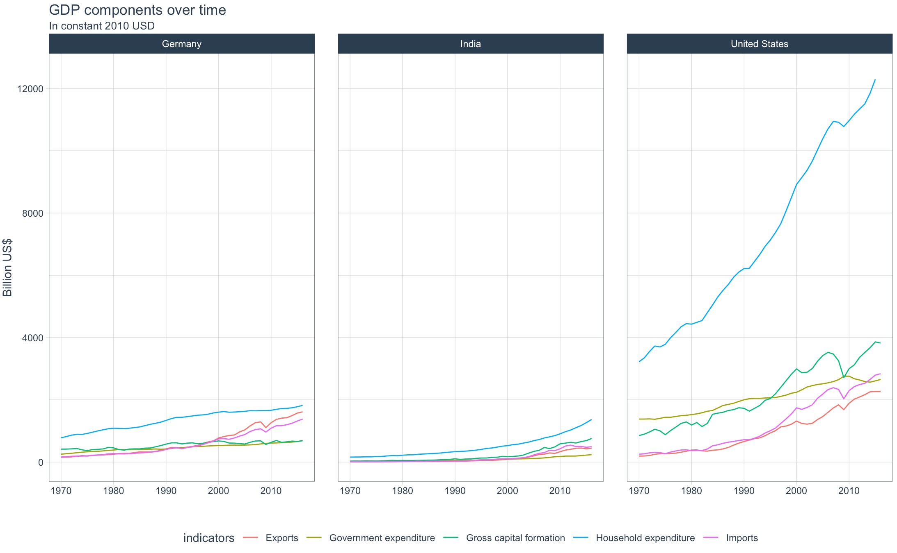
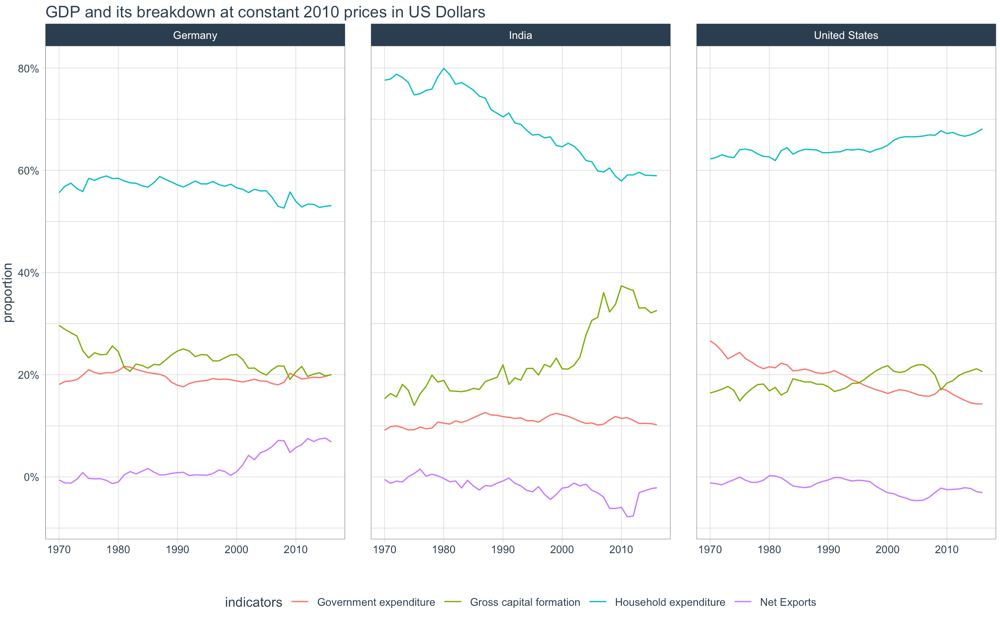
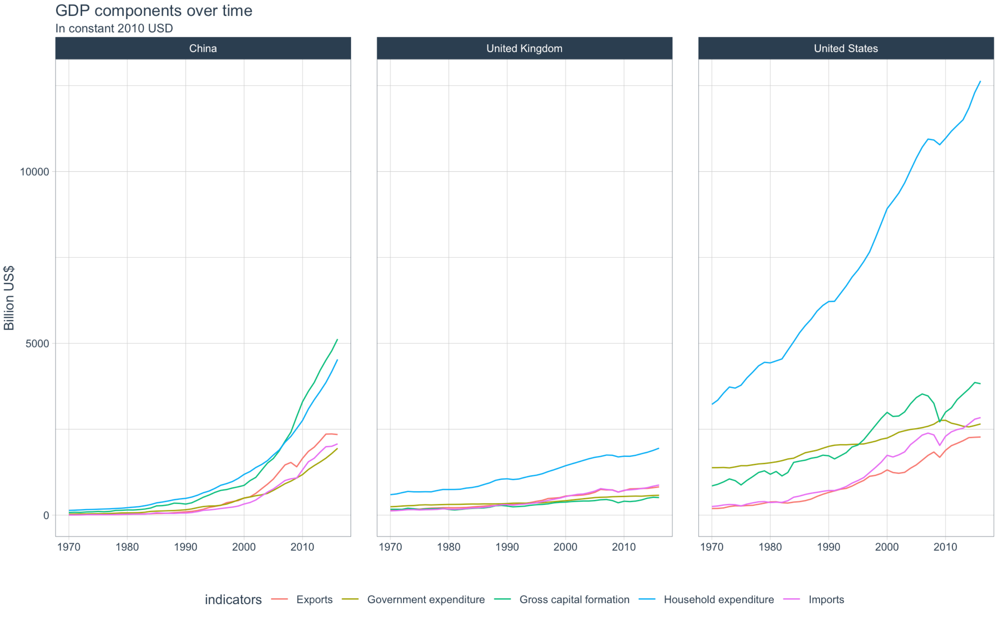

## Background

At the risk of oversimplifying things, the main components of gross domestic product, GDP are personal consumption (C), business investment (I), government spending (G) and net exports (exports - imports). 

More more about GDP and the different approaches in calculating at the [Wikipedia GDP page](https://en.wikipedia.org/wiki/Gross_domestic_product).


Look at the data from the [United Nations' National Accounts Main Aggregates Database](https://unstats.un.org/unsd/snaama/Downloads), which contains estimates of total GDP and its components for all countries from 1970 to today. Look at how GDP and its components have changed over time, and compare different countries and how much each component contributes to that country's GDP. 

Work with the file: [GDP and its breakdown at constant 2010 prices in US Dollars](http://unstats.un.org/unsd/amaapi/api/file/6) and it has already been saved in the Data directory. Have a look at the Excel file to see how it is structured and organised


## Data Processing
### Download the Data 

```{r read_GDP_data}
UN_GDP_data  <-  read_excel(here::here("data", "Download-GDPconstant-USD-countries.xlsx"), # Excel filename
                sheet="Download-GDPconstant-USD-countr", # Sheet name
                skip=2) # Number of rows to skip

```

### Tidy the data

Tidy the data, as it is in wide format and make it into long, tidy format. Express all figures in billions (divide values by `1e9`, or $10^9$), and rename the indicators into something shorter.

```{r reshape_GDP_data}
tidy_GDP_data  <-  UN_GDP_data
  
tidy_GDP_data[,4:50]<-tidy_GDP_data[,4:50]/10^9
k<-UN_GDP_data$`1970`/10^9

glimpse(tidy_GDP_data)


# Let us compare GDP components for these 3 countries
country_list <- c("United States","India", "Germany")
```


## Plotting
### GDP and its components
```{r gdp1_3_countries, echo=FALSE, out.width="100%"}
Chart<-tidy_GDP_data %>% 
  filter(Country %in% country_list)

Chart2<-data.frame(rep(Chart$Country,each=47))
Chart2[,2]<-rep(Chart$IndicatorName,each=47)
Chart2[,3]<-rep(1970:2016,times=51)
data <- t(as.matrix(Chart[,4:50]))
dim(data) <- c(2397,1)
Chart2[,4]<-data
names(Chart2)<-c("country","indicators","year","GDP")

Chart2$indicators<-gsub("Exports of goods and services","Exports",Chart2$indicators)
Chart2$indicators<-gsub("Imports of goods and services","Imports",Chart2$indicators)
Chart2[Chart2$indicators=="Household consumption expenditure (including Non-profit institutions serving households)",2]="Household expenditure"
Chart2$indicators<-gsub("General government final consumption expenditure","Government expenditure",Chart2$indicators)
C<-Chart2 %>% 
  filter(indicators %in% c("Gross capital formation","Exports","Imports","Household expenditure","Government expenditure"))
C %>% 
  ggplot(aes(x=year,y=GDP,group=indicators,col=indicators))+
  geom_line()+
  theme_tq()+
  facet_wrap(~country)+
  ylim(0, 12500) +
    labs(
    title = "GDP components over time",
    subtitle = "In constant 2010 USD",
    x = "",
    y = "Billion US$")+
  NULL
```



### GDP and breakdown

Recall that GDP is the sum of Household Expenditure (Consumption *C*), Gross Capital Formation (business investment *I*), Government Expenditure (G) and Net Exports (exports - imports). Even though there is an indicator `Gross Domestic Product (GDP)` in the dataframe, calculate it given its components discussed above.


```{r gdp2_reproduce, echo=FALSE, out.width="100%"}
C2<-Chart2 %>% 
  filter(indicators %in% c("Gross capital formation","Household expenditure","Government expenditure","Exports"))
C2[C2$indicators=="Exports" & C2$country == "Germany",]$GDP=C[C$indicators=="Exports" & C$country == "Germany",]$GDP-C[C$indicators=="Imports" & C$country == "Germany",]$GDP
C2[C2$indicators=="Exports" & C2$country == "India",]$GDP=C[C$indicators=="Exports" & C$country == "India",]$GDP-C[C$indicators=="Imports" & C$country == "India",]$GDP
C2[C2$indicators=="Exports" & C2$country == "United States",]$GDP=C[C$indicators=="Exports" & C$country == "United States",]$GDP-C[C$indicators=="Imports" & C$country == "United States",]$GDP
C2$indicators<-gsub("Exports","Net Exports",C2$indicators)
C2[,5]<-0
C2[1:188,5]<-rep(Chart2[Chart2$indicator=="Gross Domestic Product (GDP)" &  Chart2$country =="Germany",]$GDP,times=4)
C2[189:(188*2),5]<-rep(Chart2[Chart2$indicator=="Gross Domestic Product (GDP)" &  Chart2$country =="India",]$GDP,times=4)
C2[377:(188*3),5]<-rep(Chart2[Chart2$indicator=="Gross Domestic Product (GDP)" &  Chart2$country =="United States",]$GDP,times=4)
C2<-C2 %>% 
  mutate(proportion=GDP/V5)
C2 %>% 
  ggplot(aes(x=year,y=proportion ,group=indicators,col=indicators))+
  geom_line()+
  scale_y_continuous(labels = scales::percent) +
  facet_wrap(~country)+
    theme_tq()+
    labs(
    title = "GDP and its breakdown at constant 2010 prices in US Dollars",
    x = "",
    y = "proportion")+
  NULL

```



The last chart is showing us the composition of GDP i.e. the percentage contribution of each GDP factor (government expenditure, gross capital formation, household expenditure and net exports) for Germany, India and the USA. Germany has a fairly stable household expenditure over the time period. Net exports increases in this region from 2000 and is the highest net export percentage across all 3 countries which may be due to their strong automotive sector. India has the highest proportion of Gross capital formation. This could be because, especially relative to Germany and the US, India is a developing country (particularly in 2000) and so significant investment has been made to drive development. The sharp rise in investment (gross capital formation) has a counter-balancing relationship with household expenditure. This is because as people save a larger proportion of their income, there is more of an opportunity for significant country-wide investment. The US has experienced a gradual rise in household expenditure as a proportion of GDP as the country has not experienced fast growth but there has been a recent (2015 onwards) spike in this proportion which could be due to period of low interest rates. Government expenditure and gross capital formation in the US seem to have a symmetric relationship. A reason could be that the US government place significant importance in gross capital investment and so will bridge any gaps when 'natural agents' do not invest enough and step back when they invest a lot.


### change the country_list (including China)


```{r China}
Chart<-tidy_GDP_data %>% 
  filter(Country %in% c("China","United States","United Kingdom"))

Chart2<-data.frame(rep(Chart$Country,each=47))
Chart2[,2]<-rep(Chart$IndicatorName,each=47)
Chart2[,3]<-rep(1970:2016,times=51)
data <- t(as.matrix(Chart[,4:50]))
dim(data) <- c(2397,1)
Chart2[,4]<-data
names(Chart2)<-c("country","indicators","year","GDP")

Chart2$indicators<-gsub("Exports of goods and services","Exports",Chart2$indicators)
Chart2$indicators<-gsub("Imports of goods and services","Imports",Chart2$indicators)
Chart2[Chart2$indicators=="Household consumption expenditure (including Non-profit institutions serving households)",2]="Household expenditure"
Chart2$indicators<-gsub("General government final consumption expenditure","Government expenditure",Chart2$indicators)
C<-Chart2 %>% 
  filter(indicators %in% c("Gross capital formation","Exports","Imports","Household expenditure","Government expenditure"))
C %>% 
  ggplot(aes(x=year,y=GDP,group=indicators,col=indicators))+
  geom_line()+
  theme_tq()+
  facet_wrap(~country)+
    labs(
    title = "GDP components over time",
    subtitle = "In constant 2010 USD",
    x = "",
    y = "Billion US$")+
  NULL
```




